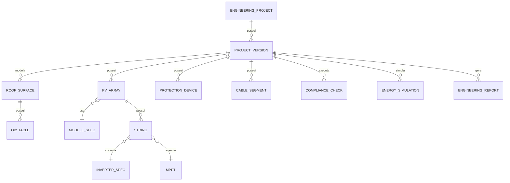

# Modelo de entidades do Solar Engine Studio

Entidades do Engine Studio (conceitual, MVP2).

```mermaid
erDiagram
    ENGINEERING_PROJECT ||--o{ PROJECT_VERSION : possui
    PROJECT_VERSION ||--o{ ROOF_SURFACE : modela
    ROOF_SURFACE ||--o{ OBSTACLE : possui
    PROJECT_VERSION ||--o{ PV_ARRAY : possui
    PV_ARRAY }o--|| MODULE_SPEC : usa
    PV_ARRAY ||--o{ STRING : possui
    STRING }o--|| INVERTER_SPEC : conecta
    STRING }o--|| MPPT : associa
    PROJECT_VERSION ||--o{ PROTECTION_DEVICE : possui
    PROJECT_VERSION ||--o{ CABLE_SEGMENT : possui
    PROJECT_VERSION ||--o{ COMPLIANCE_CHECK : executa
    PROJECT_VERSION ||--o{ ENERGY_SIMULATION : simula
    PROJECT_VERSION ||--o{ ENGINEERING_REPORT : gera
```

> Fonte: [modelagem completa](../../00-visao-geral/modelagem-completa.md), seção 35.
