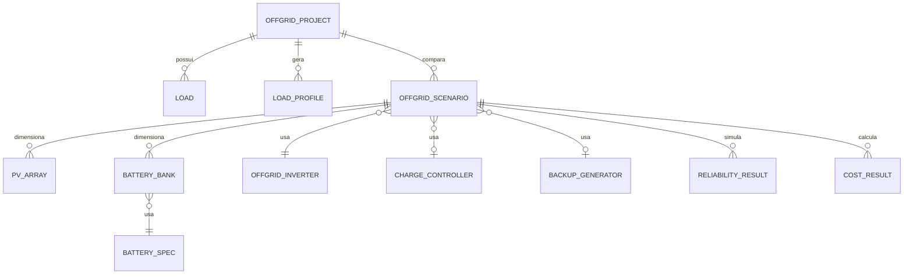

# Modelo de entidades do Off-Grid Designer

Entidades do Off-Grid Designer (conceitual, MVP3).

```mermaid
erDiagram
    OFFGRID_PROJECT ||--o{ LOAD : possui
    OFFGRID_PROJECT ||--o{ LOAD_PROFILE : gera
    OFFGRID_PROJECT ||--o{ OFFGRID_SCENARIO : compara
    OFFGRID_SCENARIO ||--o{ PV_ARRAY : dimensiona
    OFFGRID_SCENARIO ||--o{ BATTERY_BANK : dimensiona
    BATTERY_BANK }o--|| BATTERY_SPEC : usa
    OFFGRID_SCENARIO }o--|| OFFGRID_INVERTER : usa
    OFFGRID_SCENARIO }o--o| CHARGE_CONTROLLER : usa
    OFFGRID_SCENARIO }o--o| BACKUP_GENERATOR : usa
    OFFGRID_SCENARIO ||--o{ RELIABILITY_RESULT : simula
    OFFGRID_SCENARIO ||--o{ COST_RESULT : calcula
```

> Fonte: [modelagem completa](../../00-visao-geral/modelagem-completa.md), seção 36.
