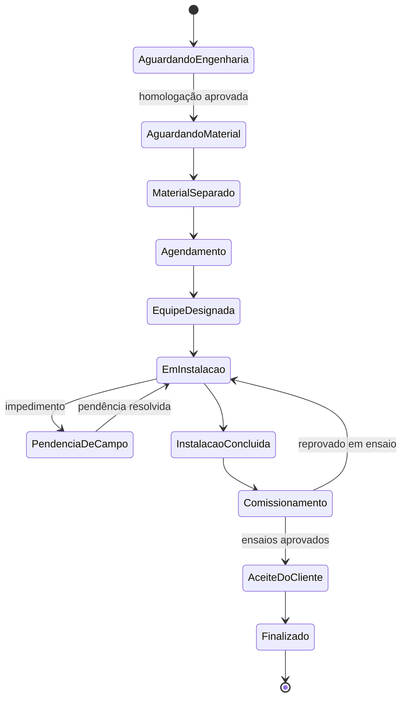

# Máquina de estados da instalação

Status sugeridos na seção 8.15 da modelagem, organizados como máquina de estados (Fase 11 — Execução e lifecycle).

```mermaid
stateDiagram-v2
    [*] --> AguardandoEngenharia
    AguardandoEngenharia --> AguardandoMaterial: homologação aprovada
    AguardandoMaterial --> MaterialSeparado
    MaterialSeparado --> Agendamento
    Agendamento --> EquipeDesignada
    EquipeDesignada --> EmInstalacao
    EmInstalacao --> PendenciaDeCampo: impedimento
    PendenciaDeCampo --> EmInstalacao: pendência resolvida
    EmInstalacao --> InstalacaoConcluida
    InstalacaoConcluida --> Comissionamento
    Comissionamento --> EmInstalacao: reprovado em ensaio
    Comissionamento --> AceiteDoCliente: ensaios aprovados
    AceiteDoCliente --> Finalizado
    Finalizado --> [*]
```
